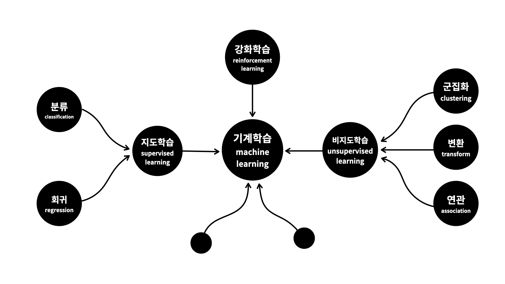

# Machine-Learning

0. 머신러닝의 분류
    - https://youtu.be/Z8tZjIOptZI?si=fIX2B-OkYZA6xZtp

1. 지도학습(Supervised Learning)
    - https://youtu.be/hnc1DGz9UCU 
        1. 회귀(Regression)
        - https://youtu.be/qT8SxIBx-dE
        2. 분류(Classification)
        - https://youtu.be/7lRkauI2OIc

2. 비지도학습(Unsupervised Learning)
    - https://youtu.be/xwe1cbZaFEg
        1. 군집화(Clustering)
        - https://youtu.be/6wskh8xKRNM
        2. 연관 규칙 학습(Association rule learning)
        - https://youtu.be/k2o3pe_qy4Y

3. 강화학습(Reinforcement Learning)
    - https://youtu.be/BPCAP7DHLYw

4. 나에게 필요한 머신러닝
    - https://youtu.be/9HnAVKPk_bg

- 출처: https://www.youtube.com/@coohde
